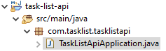
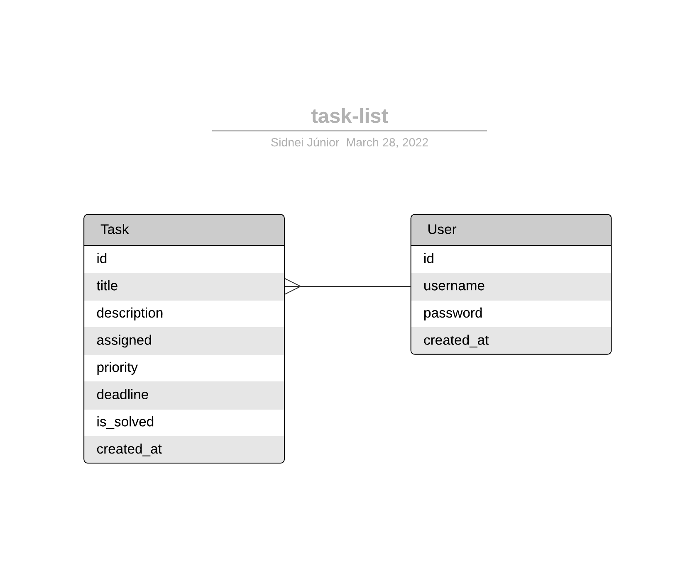

# Task List API

Para rodar o projeto copie o repositório e execute em seu Java IDE

## Diagrama Entidade-Relacional

## Rotas
 1. [C] Create Task
 2. [R] List Tasks
 3. [U] Update Task
 4. [D] Delete Task
 ### Testes das rotas
 O testes das rotas foram feitas com o Insomnia (Coleção de requisições para importação junto ao projeto. Nome do arquivo: Insomnia_task-list-api)

## Documentation
Ferramenta Swagger usada para documentar as rotas da API
<a href="https://task-list-api1.herokuapp.com/swagger-ui/index.html">TESTAR</a>

## Deploy
Deploy feito no Heroku

## JWT
Geração de JWT Token e proteção das rotas feitos na branch _feature/auth-with-jwt_
